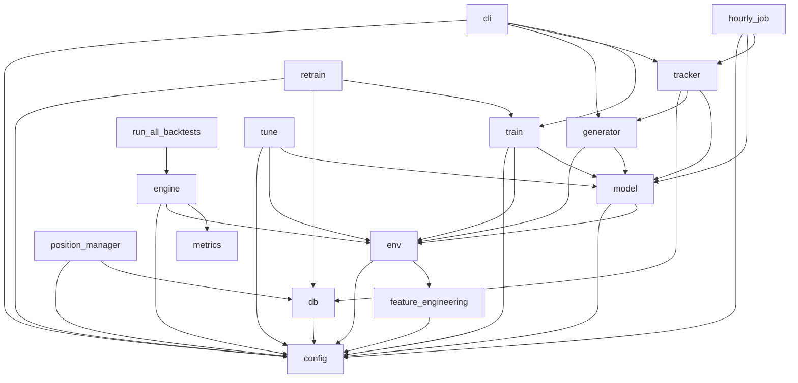

# Project Context

> **Auto-generated by [code-mapper](https://github.com/your-org/code-mapper).**  
> Read this file instead of scanning source files — it captures the full structure at a fraction of the token cost.
> `rl_strategy` · 24 files (python×24) · 19 classes · 44 functions · ~4,397 source lines

---
## File Structure

```
rl_strategy/
└── __init__.py
├── agent/
  └── __init__.py
  └── env.py
  └── model.py
  └── retrain.py
  └── train.py
  └── tune.py
├── backtest/
  └── __init__.py
  └── engine.py
  └── metrics.py
└── cli.py
└── config.py
├── data/
  └── __init__.py
  └── feature_engineering.py
├── paper_trading/
  └── __init__.py
  └── db.py
  └── tracker.py
├── portfolio/
  └── __init__.py
  └── position_manager.py
└── run_all_backtests.py
├── scheduler/
  └── __init__.py
  └── hourly_job.py
├── signals/
  └── __init__.py
  └── generator.py
```

## Class Diagram

```mermaid
classDiagram
    class AllocationResult["«dataclass» AllocationResult"] {
        +ticker: str
        +can_open: bool
        +reason: str
        +max_shares: float
    }
    class BacktestEngine["BacktestEngine"] {
        +run()
        +save_results()
        +__init__()
    }
    class BacktestMetrics["«dataclass» BacktestMetrics"] {
        +ticker: str
        +num_episodes: int
        +total_trades: int
        +mean_return: float
    }
    class EpisodeResult["«dataclass» EpisodeResult"] {
        +episode_id: int
        +total_return: float
        +total_return_pct: float
        +num_trades: int
    }
    class FeatureEngineer["FeatureEngineer"] {
        +load_ohlcv()
        +fetch_sentiment_from_db()
        +fetch_sentiment_from_api()
        +fetch_risk_from_db()
        +fetch_risk_from_api()
        +build_features()
        +get_latest_features()
        ...
    }
    class PaperTradingDB["PaperTradingDB"] {
        +get_position()
        +update_position()
        +record_trade()
        +record_equity()
        +get_trades()
        +get_all_positions()
        +get_performance_stats()
        ...
    }
    class PaperTradingTracker["PaperTradingTracker"] {
        +update_market_price()
        +execute_signal()
        +generate_and_execute()
        +get_portfolio_state()
        +record_equity_snapshot()
        +get_trade_history()
        +print_status()
        ...
    }
    class PortfolioState["«dataclass» PortfolioState"] {
        +cash: float
        +positions_value: float
        +total_equity: float
        +unrealized_pnl: float
    }
    class Position["«dataclass» Position"] {
        +ticker: str
        +shares: float
        +entry_price: float
        +entry_time: datetime
    }
    class PositionLimits["«dataclass» PositionLimits"] {
        +max_positions: int
        +max_position_pct: float
        +max_sector_pct: float
        +min_cash_reserve_pct: float
    }
    class PositionManager["PositionManager"] {
        +get_portfolio_state()
        +can_open_position()
        +get_sector_exposure()
        +print_status()
        +__init__()
    }
    class RLAgent["RLAgent"] {
        +train()
        +predict()
        +save()
        +load()
        +evaluate()
        +__init__()
    }
    class RLConfig["«dataclass» RLConfig"] {
        +tickers: List
        +price_feature_periods: List
        +sentiment_enabled: bool
        +sentiment_features: List
    }
    class Signal["«dataclass» Signal"] {
        +ticker: str
        +timestamp: datetime
        +action: str
        +confidence: float
    }
    class SignalGenerator["SignalGenerator"] {
        +generate_signal()
        +generate_signals_batch()
        +__init__()
    }
    class Trade["«dataclass» Trade"] {
        +id: Optional
        +ticker: str
        +action: str
        +shares: float
    }
    class TradeRecord["«dataclass» TradeRecord"] {
        +entry_step: int
        +exit_step: int
        +entry_price: float
        +exit_price: float
    }
    class TradingEnv["TradingEnv"] {
        +reset()
        +step()
        +render()
        +__init__()
    }
    class TrainingCallback["TrainingCallback"] {
        +__init__()
    }
```



## Module Dependencies



## Symbol Index


**`agent\env.py`** `python`
> Custom Gymnasium Trading Environment for FinRL.
- `class TradingEnv(Env)`  — Custom trading environment for reinforcement learning.
  methods: `reset`, `step`, `render`
- `def create_env_from_ticker(ticker: str, lookback: int, initial_cash: float) → Optional`  — Factory function to create environment from ticker.
- `def test_environment()`  — Test the trading environment.

**`agent\model.py`** `python`
> FinRL Model Wrapper for PPO Agent.
- `class TrainingCallback(BaseCallback)`  — Custom callback for logging training progress.
- `class RLAgent`  — Reinforcement Learning Agent wrapper.
  methods: `train`, `predict`, `save`, `load`, `evaluate`
- `def train_agent(ticker: str, total_timesteps: int, save_path: Optional) → Tuple`  — Train an RL agent for a specific ticker.
- `def load_agent(ticker: str, model_path: str) → RLAgent`  — Load a trained agent.
- `def test_model()`  — Test model wrapper.

**`agent\retrain.py`** `python`
> Auto-retrain trigger for RL agents.
- `def check_degradation(ticker: str, thresholds: Optional) → Tuple`  — Check if a model's performance has degraded enough to warrant retraining.
- `def check_all_tickers(thresholds: Optional, auto_retrain: bool, retrain_timesteps: int) → Dict`  — Check all configured tickers for degradation.

**`agent\train.py`** `python`
> Training script for RL agents.
- `def setup_paths()`  — Setup import paths.
- `def save_versioned_model(ticker: str, model_path: str, metrics: Dict, timesteps: int)`  — Save a timestamped version of the model and update registry.
- `def list_model_versions(ticker: str) → List`  — List all saved versions for a ticker.
- `def rollback_model(ticker: str, version: Optional) → Optional`  — Rollback to a previous model version.
- `def train_single_ticker(ticker: str, timesteps: int) → str`  — Train agent for a single ticker.
- `def train_all_tickers(timesteps: int)`  — Train agents for all configured tickers.
- `def main()`  — Main entry point for training.

**`agent\tune.py`** `python`
> Hyperparameter tuning via grid search for RL agents.
- `def run_grid_search(ticker: str, grid: Optional, timesteps: int, eval_episodes: int) → List`  — Run hyperparameter grid search for a ticker.

**`backtest\engine.py`** `python`
> Episode-based backtest engine for RL strategy.
- `class BacktestEngine`  — Episode-based backtest runner for RL agents.
  methods: `run`, `save_results`
- `def run_backtest(ticker: str, model_path: Optional, num_episodes: int, train_split: float) → BacktestMetrics`  — Convenience function to run a full backtest.

**`backtest\metrics.py`** `python`
> RL-native backtest metrics.
- `«dataclass» class TradeRecord`  — Single trade executed during backtest.
- `«dataclass» class EpisodeResult`  — Results from a single backtest episode.
- `«dataclass» class BacktestMetrics`  — Aggregated metrics across all episodes.
- `def compute_sharpe_ratio(returns: List, risk_free_rate: float) → float`  — Compute annualized Sharpe ratio from per-step returns.
- `def compute_max_drawdown(equity_curve: List) → float`  — Compute maximum drawdown as a percentage.
- `def compute_action_distribution(action_counts: Dict) → Dict`  — Convert raw action counts to HOLD/BUY/SELL percentages.
- `def aggregate_metrics(ticker: str, episodes: List, train_episodes: Optional) → BacktestMetrics`  — Aggregate episode-level results into summary metrics.

**`cli.py`** `python`
> Command Line Interface for RL Strategy.
- `def setup_paths()`
- `def cmd_signals(ticker: str, all_tickers: bool)`  — Generate current signals.
- `def cmd_train(ticker: str, all_tickers: bool, timesteps: int)`  — Train RL agent.
- `def cmd_backtest(ticker: str, episodes: int, train_split: float)`  — Run backtest with trained agent using the RL-native backtest engine.
- `def cmd_paper()`
- `def cmd_positions()`
- `def cmd_results(ticker: str)`  — View evaluation results.
- `def cmd_versions(ticker: str)`  — List model versions.
- `def cmd_rollback(ticker: str, version: str)`  — Rollback to a previous model version.
- `def cmd_tune(ticker: str, timesteps: int, eval_episodes: int)`  — Run hyperparameter tuning.
- `def cmd_retrain(ticker: str, all_tickers: bool, auto: bool, retrain_timesteps: int)`  — Check for model degradation and optionally retrain.
- `def cmd_portfolio()`  — Show portfolio status with position limits.
- `def main()`  — Main CLI entry point.

**`config.py`** `python`
> Configuration for RL Strategy.
- `«dataclass» class RLConfig`  — Master configuration for RL strategy.
- `def get_config() → RLConfig`  — Get or create config singleton.

**`data\feature_engineering.py`** `python`
> Feature engineering for RL agent.
- `class FeatureEngineer`  — Build feature vectors from multiple data sources.
  methods: `load_ohlcv`, `fetch_sentiment_from_db`, `fetch_sentiment_from_api`, `fetch_risk_from_db`, `fetch_risk_from_api`, `build_features`, `get_latest_features`
- `def test_feature_engineering()`  — Test the feature engineering pipeline.

**`paper_trading\db.py`** `python`
> Database module for RL strategy paper trading.
- `«dataclass» class Position`  — Current position state.
- `«dataclass» class Trade`  — Executed trade record.
- `class PaperTradingDB`  — SQLite database for paper trading.
  methods: `get_position`, `update_position`, `record_trade`, `record_equity`, `get_trades`, `get_all_positions`, `get_performance_stats`
- `def test_db()`  — Test the database module.

**`paper_trading\tracker.py`** `python`
> Paper Trading Tracker for RL Strategy.
- `«dataclass» class PortfolioState`  — Current portfolio state.
- `class PaperTradingTracker`  — Track paper trading positions and execute trades.
  methods: `update_market_price`, `execute_signal`, `generate_and_execute`, `get_portfolio_state`, `record_equity_snapshot`, `get_trade_history`, `print_status`
- `def test_tracker()`  — Test paper trading tracker.

**`portfolio\position_manager.py`** `python`
> Per-ticker position coordination for RL strategy.
- `«dataclass» class PositionLimits`  — Position limit configuration.
- `«dataclass» class AllocationResult`  — Result of position allocation check.
- `class PositionManager`  — Manages position limits and allocation across RL strategy tickers.
  methods: `get_portfolio_state`, `can_open_position`, `get_sector_exposure`, `print_status`

**`scheduler\hourly_job.py`** `python`
> Hourly Job Scheduler for RL Strategy.
- `def setup_paths()`
- `def run_hourly()`  — Execute hourly paper trading job.
- `def schedule_windows_task()`  — Create Windows Task Scheduler entry.
- `def remove_windows_task()`  — Remove Windows Task Scheduler entry.
- `def test_hourly()`  — Test hourly job manually.

**`signals\generator.py`** `python`
> Signal Generator for RL Strategy.
- `«dataclass» class Signal`  — Trading signal output matching existing strategy format.
- `class SignalGenerator`  — Generate trading signals from RL agent predictions.
  methods: `generate_signal`, `generate_signals_batch`
- `def create_generator(ticker: str, model_path: Optional) → Optional`  — Factory function to create signal generator.
- `def test_generator()`  — Test signal generator.